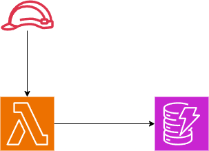
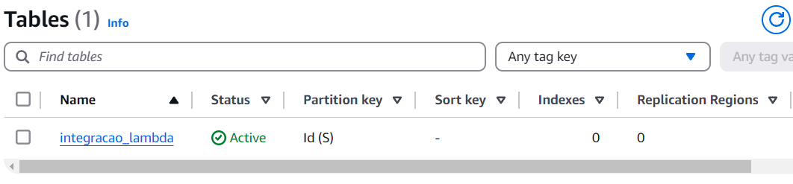
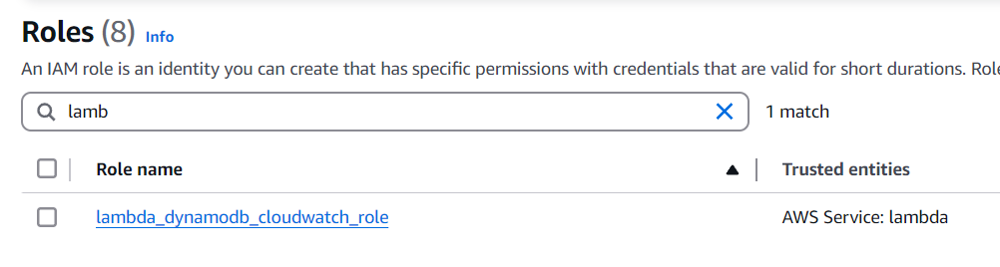
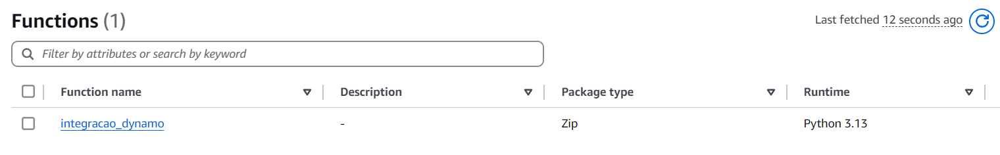
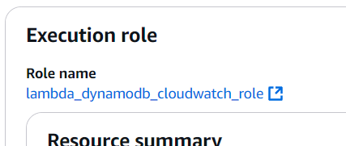
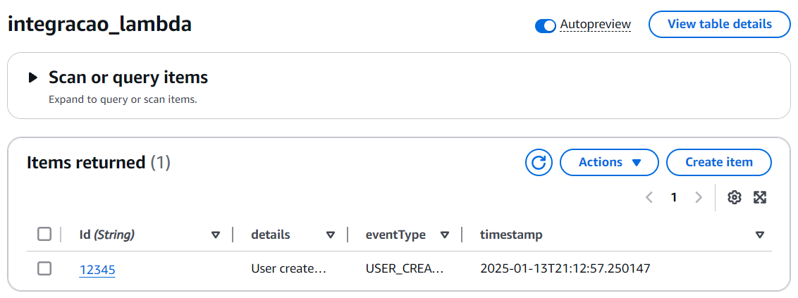

# Envio de Dados de uma Lambda para o DynamoDB usando Terraform

Este projeto é uma prova de conceito (PoC) que demonstra como configurar e implementar uma função AWS Lambda em Python para enviar dados para uma tabela do DynamoDB. Toda a infraestrutura necessária é provisionada utilizando o Terraform.



## Provisionando a infra

Inicie o diretório de trabalho do terraform
```bash
terraform init
```

Gere o plano
```bash
terraform plan -out="tfplan.out" ( ou apenas terraform plan )
```

Execute o plano
```bash
terraform apply "tfplan.out" ( ou apenas terraform apply )
```

## Screenshots dos recursos provisionados

Dynamo 


Role


Lambda


Role associada a Lambda


# Testando por CLI

```bash
aws lambda invoke --function-name integracao_dynamo --payload fileb://event.json output.txt
```

# Registro incluído


